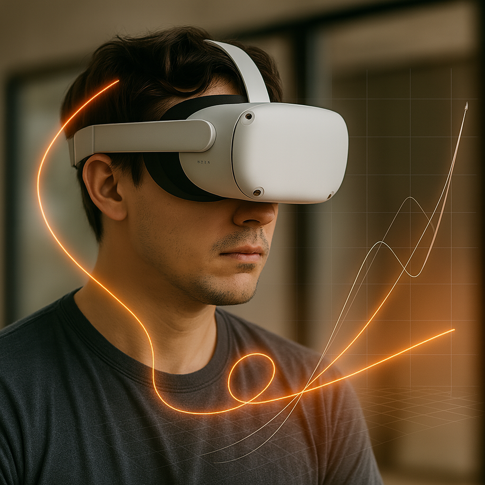

# 🎯 Multi-Horizon IMU Prediction

This project explores **deep learning** methods for predicting head movement from IMU data, targeting VR/AR latency reduction.  
We compare **direct multi-horizon prediction** (10 ms, 20 ms, 30 ms ahead) with **single-step recursive prediction** to demonstrate **prediction drift**.

---

## 📂 Repository Structure

```
├── data/               # Raw or preprocessed IMU datasets
├── notebooks/          # Jupyter notebooks for experiments
│   ├── train_multi.ipynb    # Multi-horizon model training
│   ├── train_single.ipynb   # Single-horizon baseline model training
│   └── evaluate.ipynb       # Comparison & drift analysis
├── models/             # Saved model checkpoints
├── docs/               # Documentation & images
│   └── vrDemoPicture.png    # Demo image used in README
├── requirements.txt    # Python dependencies
└── README.md           # This file
```

---

## 📊 Example Output

### Direct Multi-Horizon Prediction
Predicts 10 ms, 20 ms, 30 ms ahead in a single forward pass.

```
Epoch 01 | Train Loss: 0.8951 | Val Loss: 55.0931 (norm MSE) | Val MAE: 0.17 | RMSE: 0.37 deg/s
Epoch 02 | Train Loss: 0.6053 | Val Loss: 51.8341 (norm MSE) | Val MAE: 0.16 | RMSE: 0.36 deg/s
```

### Single-Step Recursive Prediction
Predicts **1 ms ahead**, repeatedly feeding predictions back into the model to simulate longer horizons.  
Useful for demonstrating **prediction drift** compared to direct prediction.

---

## 🖼 Example Visualization

<p align="center">
  
  <br/>
  <sub>Orange: Model prediction trajectory. White: Ground truth trajectory.</sub>
</p>

---

## 🛠 Installation

```bash
git clone https://github.com/<your-username>/multi-horizon-imu-prediction.git
cd multi-horizon-imu-prediction
pip install -r requirements.txt
```

---

## ▶️ Usage

### 1. Prepare Data
Place your IMU CSV files in the `data/` directory.  
Files should contain timestamp, accelerometer, and gyroscope readings.

### 2. Train Multi-Horizon Model
```bash
jupyter notebook notebooks/train_multi.ipynb
```

### 3. Train Single-Horizon Model
```bash
jupyter notebook notebooks/train_single.ipynb
```

### 4. Evaluate & Compare Drift
```bash
jupyter notebook notebooks/evaluate.ipynb
```

---

## 📚 Background

Modern VR/AR headsets suffer from **motion-to-photon latency** — the delay between head movement and the visual update.  
By **predicting head movement before it happens**, we can render the **future viewpoint** and reduce perceived latency.  
This project uses **real IMU sensor data** and compares different prediction strategies.

---

## 📄 License
This project is licensed under the **MIT License**.

---
